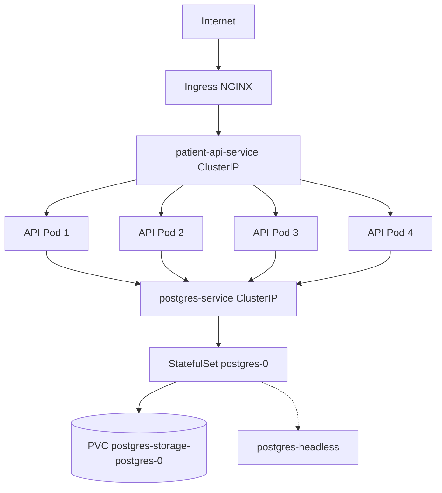

# Patient Management — Assignment Documentation

## 1. Requirement Understanding

Build a multi-tier Kubernetes system with:

- **API tier (Spring Boot):** CRUD REST API, external access via Ingress, ConfigMap-based DB config, Secret-based password, HPA, rolling updates, self-healing, CPU/memory limits.
- **Database tier (PostgreSQL):** 5–10 records, persistence, cluster-internal only, auto-recovery.
- **DevOps:** Docker image on Docker Hub (`vikaskumarjagga/patient-management`), deploy on **GKE**.
- **FinOps:** Resource requests/limits + metrics-based optimization.

## 2. Assumptions

| # | Assumption |
|---|------------|
| 1 | Entity is **Patient** with 5 attributes: firstName, lastName, age, gender, diagnosis |
| 2 | Kubernetes cluster is **GKE Standard** in `us-central1-a`, GCP project **`patient-management-500306`** |
| 3 | In-cluster PostgreSQL is used for the assignment DB tier (Cloud SQL optional for local dev only) |
| 4 | NGINX Ingress Controller is installed on GKE |
| 5 | Metrics Server is enabled for HPA and `kubectl top` |
| 6 | GKE storage class `standard-rwo` is used for StatefulSet PVC |
| 7 | Namespace: `patient-management` |
| 8 | Docker Hub: `vikaskumarjagga/patient-management:1.0.0` |

## 3. Solution Overview

### Architecture

```
                    Internet
                        |
                    Ingress
                        |
                Spring Boot API
                  (4 replicas)
                        |
              ClusterIP Service
              (postgres-service)
                        |
                    PostgreSQL
                     (1 pod)
                   StatefulSet
                        |
              PVC (volumeClaimTemplate)
```



### Tech Stack

| Tier | Components |
|------|------------|
| API | Java 21, Spring Boot 3.5, Spring Data JPA, HikariCP, PostgreSQL driver, Actuator, SpringDoc OpenAPI |
| Database | PostgreSQL 16 Alpine |
| Kubernetes | Deployment, StatefulSet, PVC, ConfigMap, Secret, HPA, Ingress, Services |

### Kubernetes Objects Map

| Object | File | Purpose |
|--------|------|---------|
| Namespace | `namespace.yaml` | Isolate resources |
| ConfigMap | `configmap-api.yaml`, `configmap-db.yaml` | External DB configuration |
| Secret | created via kubectl | DB passwords |
| Deployment | `deployment-api.yaml` | 4 API pods, rolling updates |
| StatefulSet | `statefulset-db.yaml` | 1 PostgreSQL pod with stable identity |
| PVC | `volumeClaimTemplates` in StatefulSet | Persistent database storage |
| Service (ClusterIP) | `service-api.yaml`, `service-db.yaml` | Internal routing; API → DB via DNS |
| Service (Headless) | `service-db-headless.yaml` | StatefulSet network identity |
| Ingress | `ingress-api.yaml` | External API access |
| HPA | `hpa-api.yaml` | Auto-scale API tier |

### API Endpoints

- CRUD: `/api/patients`
- Health: `/actuator/health`
- Swagger UI: `/swagger-ui.html`
- OpenAPI JSON: `/api-docs`

### Configuration

| Variable | Source | Used when |
|----------|--------|-----------|
| DB_HOST, DB_PORT, DB_NAME, DB_USERNAME | ConfigMap `api-config` | GKE / Kubernetes |
| DB_PASSWORD | Secret `db-secret` | GKE / Kubernetes |
| Local DB settings | `application-local.yml` | `spring.profiles.active=local` |
| Cloud SQL settings | `application-gcp.yml` | `spring.profiles.active=gcp` (laptop + Auth Proxy only) |

`application.yml` holds shared settings only (JPA, Actuator, HikariCP). It never stores passwords. On Kubernetes, all `DB_*` values come from ConfigMap and Secret environment variables.

Inter-tier communication uses **Service DNS** (`postgres-service`), not pod IPs.

### Seed Data

8 patients inserted once via `DataInitializer` on empty database.

## 4. Justification for Resources

### API Tier (per pod)

| Resource | Request | Limit |
|----------|---------|-------|
| CPU | 100m | 250m |
| Memory | 256Mi | 512Mi |

### DB Tier

| Resource | Request | Limit |
|----------|---------|-------|
| CPU | 100m | 500m |
| Memory | 256Mi | 512Mi |

### HPA

- Min: 4, Max: 6
- CPU target: 70%, Memory target: 80%

## 5. FinOps Optimization

### Three cost optimization opportunities

1. **Right-size API CPU/memory** after `kubectl top pods` — apply `finops-optimized-api-resources.yaml`.
2. **Tune HPA min replicas** when traffic is low (post-demo) to reduce idle pod cost.
3. **Use appropriately sized GKE nodes** (`e2-medium`), enable autoscaling, and **delete cluster** after assignment.

### Metrics workflow

```powershell
kubectl top pods -n patient-management
kubectl describe hpa patient-api-hpa -n patient-management
kubectl apply -f k8s/finops-optimized-api-resources.yaml
```

## 6. GKE Deployment Notes

- StatefulSet uses `volumeClaimTemplates` with `storageClassName: standard-rwo`.
- Headless service `postgres-headless` gives stable pod DNS (`postgres-0.postgres-headless...`).
- API connects via ClusterIP `postgres-service` (assignment-friendly service DNS).
- Ingress uses NGINX controller LoadBalancer IP as external entry point.
- API deployment includes init container waiting for `postgres-service:5432`.

## 7. Deliverables Checklist

- [x] Source code in `patient-management/`
- [x] Dockerfile
- [x] Kubernetes YAML in `k8s/`
- [x] README with Docker Hub URL: `https://hub.docker.com/r/vikaskumarjagga/patient-management`
- [ ] GitHub repo URL (add your link)
- [ ] Ingress public URL (add after GKE deploy)
- [ ] Screen recording (record demo steps from README Step 5)
